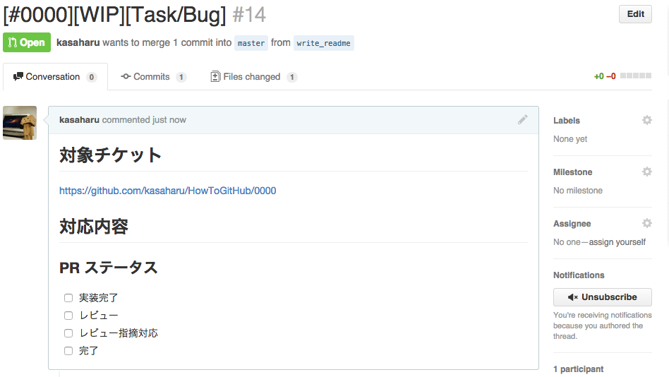

# scriptForGitHub
=======
GitHub を便利に使うためのスクリプト集

## 事前準備
* hub コマンドがインストールされていること

## コミットメッセージテンプレート
* formats/.gitmessage.txt

## Pull Request テンプレート
* formats/.pullreqmessage.txt

## How to use

### テンプレートファイルの配置
* `$ cd scripts/ `
* `$ sh set_format_files.sh `

### コミットメッセージテンプレートの使い方
* 下記コマンドを入力することで `git commit` 実行時にテンプレートファイルを読み込むようになる
    * `$ git config --global commit.template ~/.gitmessage.txt `

### Pull Request script 実行
* `$ cd scripts/ `
* `$ sh create_pullrequest.sh 0000 `
    * 0000 の部分には BTS などのチケット番号を指定する

* スクリプト実行後は下記のようなページが表示される

